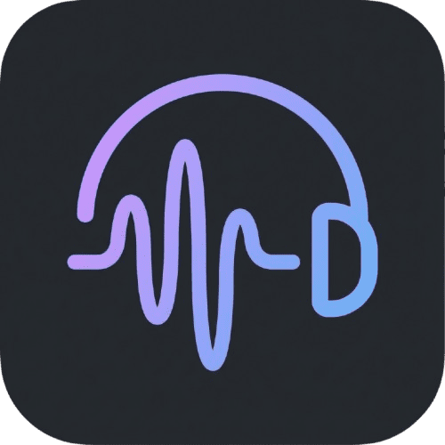

# 🎧 Ambient Sounds for VS Code

  

  <strong>Relaxe e foque melhor enquanto programa com sons ambiente imersivos.</strong>

  
  
  

---

## ✨ Funcionalidades

- 🎵 **Biblioteca de Sons** — Acesse uma vasta coleção de sons ambiente diretamente no VS Code
- 🔊 **Controle de Volume** — Ajuste o volume do áudio sem sair do editor
- ⭐ **Favoritos** — Salve seus sons preferidos para acesso rápido
- 🔄 **Loop Contínuo** — Os sons tocam em loop para uma experiência ininterrupta
- 🔍 **Busca Inteligente** — Encontre rapidamente o som perfeito para o momento
- 🌐 **API Remota + Fallback Local** — Sons carregados da nuvem com fallback para arquivos locais
- 🎨 **Interface Nativa** — Design que segue perfeitamente o tema do VS Code

---

## 📦 Instalação

1. Abra o **VS Code**
2. Vá para **Extensions** (`Ctrl+Shift+X`)
3. Pesquise por **"Ambient Sounds"**
4. Clique em **Install**

Ou instale diretamente pelo [VS Code Marketplace](https://marketplace.visualstudio.com/items?itemName=pedrohusky.ambient-sounds).

---

## 🚀 Como Usar

1. Clique no ícone **🎵** na barra lateral esquerda (Activity Bar)
2. Escolha um som da lista
3. Ajuste o volume conforme preferir
4. Clique em ⭐ para adicionar aos favoritos
5. Use o botão **Parar** para interromper a reprodução

---

## 🎼 Sons Disponíveis

A extensão oferece uma variedade de sons ambiente, incluindo:

| Categoria | Exemplos |
|-----------|----------|
| 🌧️ **Natureza** | Chuva, Trovões, Floresta, Ondas do Mar |
| 🔥 **Relaxamento** | Lareira, Vento, Pássaros |
| ☕ **Ambientes** | Café, Escritório, Biblioteca |
| 🌌 **Atmosféricos** | Ruído Branco, Ruído Rosa, Espaço |

---

## ⚙️ Requisitos

- VS Code versão **1.85.0** ou superior

---

## 🤝 Contribuindo

Contribuições são bem-vindas! Sinta-se à vontade para:

1. 🍴 Fazer um fork do projeto
2. 🌿 Criar uma branch (`git checkout -b feature/nova-funcionalidade`)
3. 💾 Commit suas mudanças (`git commit -m 'Adiciona nova funcionalidade'`)
4. 📤 Push para a branch (`git push origin feature/nova-funcionalidade`)
5. 🔃 Abrir um Pull Request

---

## 📄 Licença

Este projeto está licenciado sob a [MIT License](LICENSE.md).

---

## 💖 Apoie o Projeto

Se você gosta da extensão, considere:

- ⭐ Dar uma estrela no [GitHub](https://github.com/pedrohusky/ambient-sounds)
- 📝 Deixar uma avaliação no [Marketplace](https://marketplace.visualstudio.com/items?itemName=pedrohusky.ambient-sounds)
- 🐛 Reportar bugs ou sugerir melhorias nas [Issues](https://github.com/pedrohusky/ambient-sounds/issues)

---

  Feito com ❤️ por <a href="https://github.com/pedrohusky">Pedro Husky</a>

